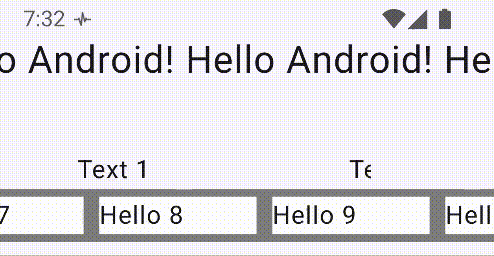
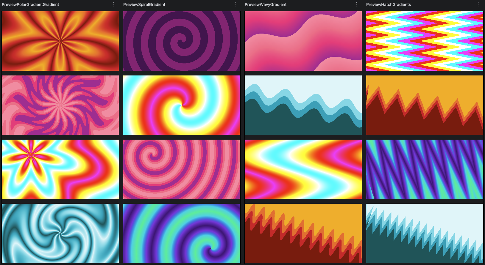

# Compose Animation 
This repository contains various examples and techniques aimed at building delicious compose UI.

## Marquee.kt

This is a minimal implementation of an old-school marquee effects.
It features a Node based modifier which does unbounded layout, 
custom drawing, and snapshot state to continuously trigger the render phase only.

This modifier can be applied to any composable, as seen in the capture:

## Gradients

Leverage LinearGradient to build new types of gradients by warping the space in a custom shader.

